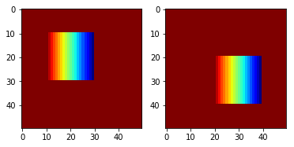
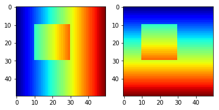
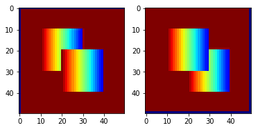
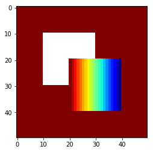

# Direct Warp module

This module has been created in the context of my PhD thesis.

**Robust Learning of a depth map for obstacle avoidance with a monocular stabilized flying camera**

See dedicated page [here](https://clementpinard.fr/phd_thesis/)

this is a custom C++/Cuda implementation of Direct Warp module, a simple graphic pipeline for direct image warping, designed so that occluded area are invalid. Be careful, this operation is not spatially differentiable !

This [tutorial](http://pytorch.org/tutorials/advanced/cpp_extension.html) was used as a basis for implementation

- Build and Install C++ and CUDA extensions by executing `python setup.py install`,
- Test three modules by executing `python test_projection.py`, `python test_warping.py` and `python test_occlusion_map.py`

# Requirements

This module is expected to compile on Pytorch >= `1.11.0` (tested on `1.12.1`, CUDA `11.6`),  `Python > 3.5`

# Usage direct projection

`from pytorch_direct_warp.direct_proj import direct_projection`

Every image to warp is considered as a "square" cloud, so each point will have a 3D position and a size.

```
input (B x C x N), pos and size (B x N x 4), frame matrix (B x 3 x 3) -> output (B x C x H x W), warped depth (B x H x W)
 ```
Its rendering is based on a simple loop which will colorize the area `[(x-s/2)z, (x+s/2)/z] x [(y-s/2)/z, (y+s/2)/z]` provided it has not already been colorized with a closer square (lower `z`). `x,y,z,s` are the 4 parametersof the point cloud `pos_size`.

Note that for a simple warp, size `s` is equal to depth `z`, because it is the exact size so that the camera field of view is completely filled. Alos, Number of points `N` is simply unravelled depth dimensions `H * W`

if input is not provided, only warped depth is outputted.

As there is not interpolation, outputs are not spacially differentiable, but the module keeps a lookup table so that pixel value (depth and input) differentiation is back propagated

# Usage direct warping

`from pytorch_direct_warp.direct_warp import DirectWarper`

Thanks to this wrapper, direct depth and img warping is simplified. You need to provide a `BxHxW` depth tensor and an optional `BxCxHxW` image tensor, as long as a `Bx3x4`transformation matrix, and `Bx3x3` intrinsics and its inverse.

# Occlusion map generator

Occlusion map for a depth and a pose can be obtained by warping depth and warping it back. Missing points in the resulting output have been detected as occluded or out of bound, and it is reasonable to dismiss them from any photometric loss since these points don't occur in the next frame.

This operation does not need any differentiation, it is designed to be used with an inverse warping operation, e.g. [here](https://github.com/ClementPinard/SfmLearner-Pytorch/blob/master/inverse_warp.py)

# Inverse warp vs Direct Warp examples

This section discusses the fundamental differences between direct and inverse warping for a set of points with depth and pose.
Throughout the whole experiment, we consider two `50x50` Images `I1` `I2` and a depth Map `D` corresponding to `I1`. If specified otherwise, the pose between the two frames is `P = T[-1,-1,0], R identity`, which means the camera went up and left with no rotation.



Using frame matrix and depth, we can get a point cloud corresponding to 2D coordinates in `I1` and with the pose, in `I2` . In the end, the needed coordinates can be summed with this (u,v) chart `T` of `I1` pixels in `I2`. you then get for `[i,j] in [0,50]x[0,50]` 
`Î1[i,j] = I2[T[i][j]]`



By using these coordinates, inverse warp will try to reconstruct `I1` with pixels from `I2`, while direct warp will try to reconstruct `I2` with pixels from `I1`.





As you can see, while the inverse warp shows duplication artefacts, the direct Warp shows Nan values where no colorization was done.
The main interest of this direct warp here is to warp and warp back the depth in its original coordinate system. That way, you can see that occluded values are now considered NaNs.

A more in depth study of this occlusion module is avalaible at this address : https://github.com/ClementPinard/thesis-notebooks
